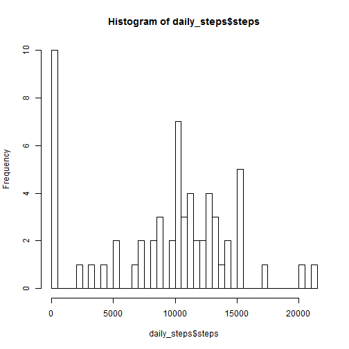
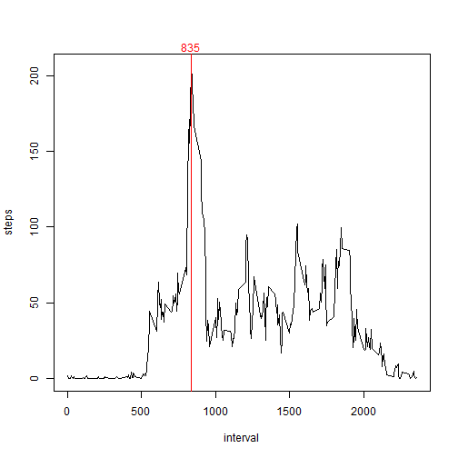
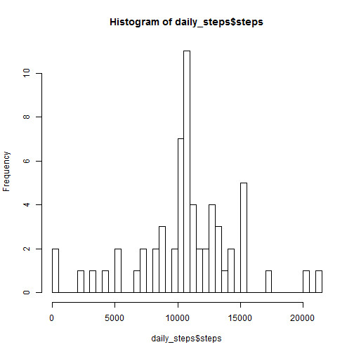
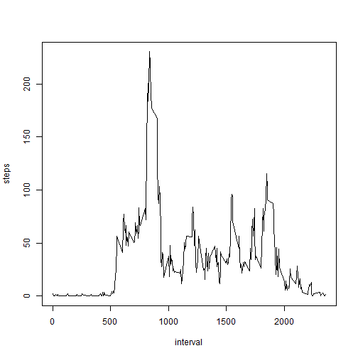
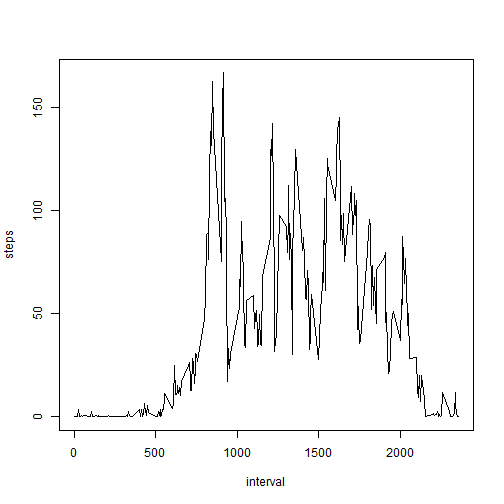

## Introduction

It is now possible to collect a large amount of data about personal
movement using activity monitoring devices such as a
[Fitbit](http://www.fitbit.com), [Nike
Fuelband](http://www.nike.com/us/en_us/c/nikeplus-fuelband), or
[Jawbone Up](https://jawbone.com/up). These type of devices are part of
the "quantified self" movement -- a group of enthusiasts who take
measurements about themselves regularly to improve their health, to
find patterns in their behavior, or because they are tech geeks. But
these data remain under-utilized both because the raw data are hard to
obtain and there is a lack of statistical methods and software for
processing and interpreting the data.

This assignment makes use of data from a personal activity monitoring
device. This device collects data at 5 minute intervals through out the
day. The data consists of two months of data from an anonymous
individual collected during the months of October and November, 2012
and include the number of steps taken in 5 minute intervals each day.

## Data

The data for this assignment can be downloaded from the course web
site:

* Dataset: [Activity monitoring data](https://d396qusza40orc.cloudfront.net/repdata%2Fdata%2Factivity.zip) [52K]

The variables included in this dataset are:

* **steps**: Number of steps taking in a 5-minute interval (missing
    values are coded as `NA`)

* **date**: The date on which the measurement was taken in YYYY-MM-DD
    format

* **interval**: Identifier for the 5-minute interval in which
    measurement was taken


The dataset is stored in a comma-separated-value (CSV) file and there
are a total of 17,568 observations in this
dataset.


## Loading and preprocessing the data

Show any code that is needed to

1. Load the data (i.e. `read.csv()`)

2. Process/transform the data (if necessary) into a format suitable for your analysis


```r
fname <- "activity.csv"
unzip("activity.zip", fname)

df <- read.csv(fname, colClasses=c(NA, "Date", NA))
```


## What is mean total number of steps taken per day?

1. Make a histogram of the total number of steps taken each day

2. Calculate and report the **mean** and **median** total number of steps taken per day


```r
mean_daily_steps <- function(df) {
  daily_steps <- aggregate(df$steps, list(df$date), sum, na.rm=T)
  names(daily_steps) <- c(names(df)[2], names(df)[1])
  hist(daily_steps$steps, 50)
  
  c(mean(daily_steps$steps), median(daily_steps$steps))
}

mm <- mean_daily_steps(df)
```

 

Mean of total number of steps taken per day: 9354.2295082

Median of total number of steps taken per day: 1.0395 &times; 10<sup>4</sup>

## What is the average daily activity pattern?

1. Make a time series plot (i.e. `type = "l"`) of the 5-minute interval (x-axis) and the average number of steps taken, averaged across all days (y-axis)

2. Which 5-minute interval, on average across all the days in the dataset, contains the maximum number of steps?


```r
avg_steps_by_interval <- aggregate(df$steps, list(df$interval), mean, na.rm=T)
names(avg_steps_by_interval) <- c(names(df)[3], names(df)[1])
plot(steps ~ interval, avg_steps_by_interval, type="l")

max_interval <- subset(
  avg_steps_by_interval, 
  steps == max(avg_steps_by_interval$steps))$interval
abline(v = max_interval, col = "red")
mtext(max_interval, at = max_interval, col = "red")
```

 


## Imputing missing values

Note that there are a number of days/intervals where there are missing
values (coded as `NA`). The presence of missing days may introduce
bias into some calculations or summaries of the data.

1. Calculate and report the total number of missing values in the dataset (i.e. the total number of rows with `NA`s)

2. Devise a strategy for filling in all of the missing values in the dataset. The strategy does not need to be sophisticated. For example, you could use the mean/median for that day, or the mean for that 5-minute interval, etc.

3. Create a new dataset that is equal to the original dataset but with the missing data filled in.

4. Make a histogram of the total number of steps taken each day and Calculate and report the **mean** and **median** total number of steps taken per day. Do these values differ from the estimates from the first part of the assignment? What is the impact of imputing missing data on the estimates of the total daily number of steps?


```r
missing_values <- sum(is.na(df$steps))

df2 <- df
means <- aggregate(steps ~ interval, data = df2, FUN=mean, na.rm=T)
df2 <- merge(df2, means, by="interval", suffixes=c("", "_mean"))
df2$steps[is.na(df2$steps)] <- df2$steps_mean[is.na(df2$steps)]
df2 <- df2[,c(2,3,1)]

mm <- mean_daily_steps(df2)
```

 

Strategy: NAs replaced by the average steps per interval.

Number of missing values imputed: 2304

Mean of total number of steps taken per day: 1.0766189 &times; 10<sup>4</sup>

Median of total number of steps taken per day: 1.0766189 &times; 10<sup>4</sup>


## Are there differences in activity patterns between weekdays and weekends?

1. Create a new factor variable in the dataset with two levels -- "weekday" and "weekend" indicating whether a given date is a weekday or weekend day.

2. Make a panel plot containing a time series plot (i.e. `type = "l"`) of the 5-minute interval (x-axis) and the average number of steps taken, averaged across all weekday days or weekend days (y-axis). The plot should look something like the following, which was created using **simulated data**:


```r
df2$week_factor <- factor(
  weekdays(df2$date) == "Sunday" | weekdays(df2$date) == "Saturday")
levels(df2$week_factor) <- c("weekday", "weekend")

avg_steps_wd <- aggregate(steps ~ interval, data=df2[df2$week_factor=="weekday",], mean, na.rm=T)
plot(steps ~ interval, avg_steps_wd, type="l")
```

 


```r
avg_steps_we <- aggregate(steps ~ interval, data=df2[df2$week_factor=="weekend",], mean, na.rm=T)
plot(steps ~ interval, avg_steps_we, type="l")
```

 
